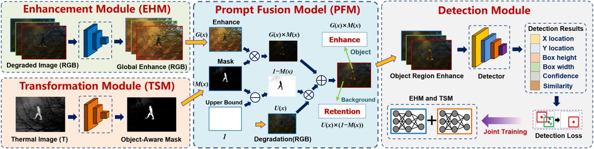
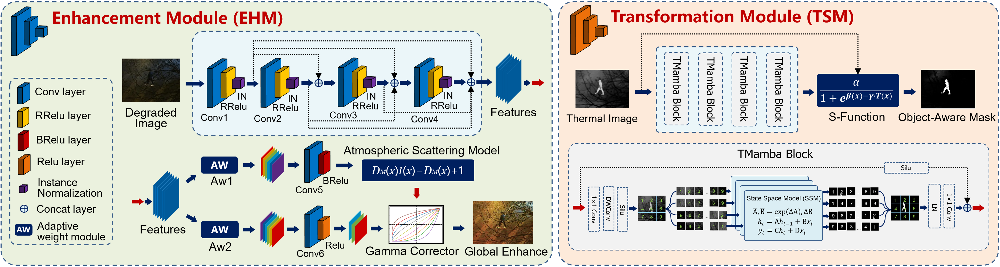

## Seeing Only the Focus: RGB-T Object-Aware Region Enhancement for Object Detection in Harsh Environments

Xudong Wang, Xi’ai Chen *, Huijie Fan, Weihong Ren, Shuai Wang, Yandong Tang, Lianqing Liu and Zhi Han.  
  
The State Key Laboratory of Robotics, Shenyang Institute of Automation, Chinese Academy of Sciences, and also University of Chinese Academy of Sciences (UCAS). (e-mail: wangxudong@sia.cn).

## Our work
In this manuscript, we propose a new Object-Aware Region Enhancement (OARE) method to improve object detection in harsh environments.

  &emsp;&emsp; 

  &emsp;&emsp; 

## Dependencies
* Python 3.8
* PyTorch 1.8.1 + cu111
* torchvision 0.9.1 + cu111
* numpy
* opencv-python
* skimage
* hiddenlayer
* matplotlib
* PIL
* math
* os
  
## Architecture
model.py: The definition of the model class.

utils.py: Some tools for network training and testing.

data.py: Preparation tools for the training dataset.

test.py: Quick detection test for harsh images.

testall.py: Detection test for all harsh images dataset.

train.py: Training the dehazing model.

## Test
1. Please put the images to be tested into the ``test_images`` folder. We have prepared the images of the experimental results in the paper.
2. Please run the ``test.py``, then you will get the following results for OARE:

  &emsp;&emsp; 

## Test all
If you want to test the results on a labeled dataset such as [M3FD](https://github.com/JinyuanLiu-CV/TarDAL), you can go through the following procedure:
1. Please put the dataset to be tested into the ``test0`` folder.
2. Please run the ``testall.py``, then you will get the detection results mAP50 and Inference time.

## Other codes will be updated soon

